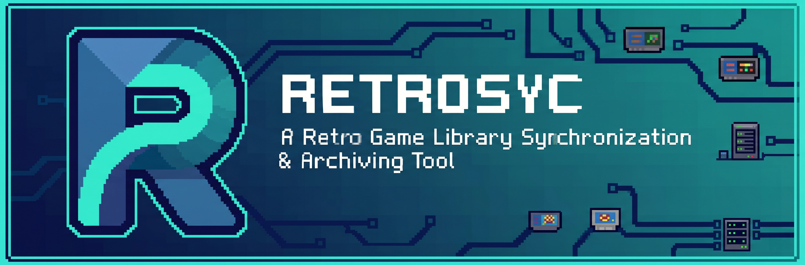
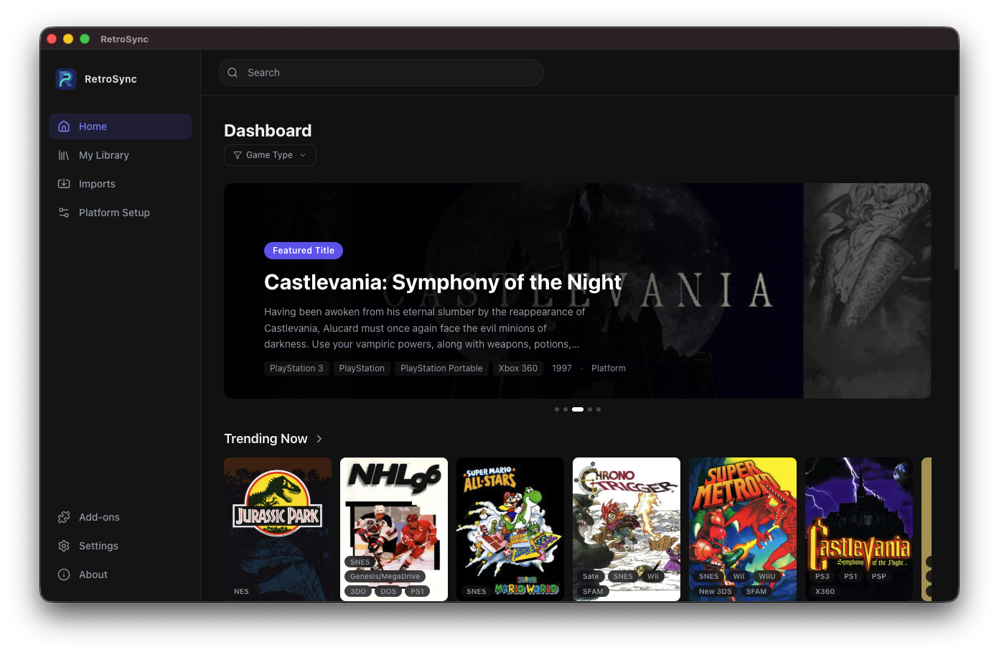
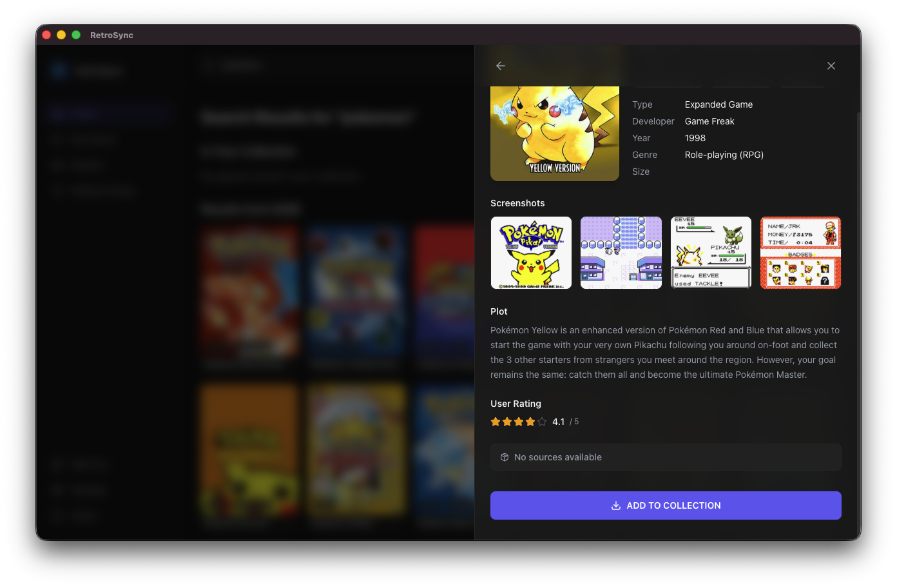

<!-- markdownlint-disable MD041 -->



<!-- markdownlint-enable MD041 -->

# RetroSync

[](https://github.com/tvcsantos/retrosync/releases/latest)
[](https://github.com/tvcsantos/retrosync/releases/latest)
[](LICENSE)

A desktop app for managing retro game ROM libraries. Search games via IGDB, discover ROMs through extensible addon sources, and organize your collection by platform and device.

## Features

- **IGDB Integration** - Search and browse games with full metadata, cover art, and platform info
- **Addon System** - Extensible plugin architecture for ROM and BIOS sources
- **Import Manager** - Queued imports with progress tracking, pause/resume, and concurrent transfers
- **Device Profiles** - Pre-configured profiles for popular handhelds (Miyoo Mini, Anbernic, Steam Deck, etc.)
- **Library Management** - Organize ROMs by platform with automatic file placement
- **BIOS Management** - Organize BIOS files and install firmware files for each platform

## Download

Download the latest release for your platform from the [Releases page](https://github.com/tvcsantos/retrosync/releases/latest), or visit the [Get Started](https://tvcsantos.github.io/retrosync/get-started) guide for per-platform download cards and setup instructions.

## Showcase





## Quick Start

```bash
git clone https://github.com/tvcsantos/retrosync.git
cd retrosync
npm install
npm run dev
```

## Build

```bash
npm run build:mac      # macOS DMG
npm run build:win      # Windows installer
npm run build:linux    # Linux packages (AppImage, deb)
```

## Documentation

- [Architecture](docs/architecture.md) - Tech stack, design decisions, data flow
- [Addon Development](docs/addon-development.md) - Build external addons for RetroSync
- [Contributing](docs/contributing.md) - Development setup, code style, project structure

## Tech Stack

Electron | React 19 | TypeScript | Vite | SQLite (Drizzle ORM) | Tailwind CSS 4 | Zustand

## License

See [LICENSE](LICENSE) for details.
